## Operational Calibration: Debugging Confidence Errors for DNNs in the Field (2020)

Zenan Li, Xiaoxing Ma, Chang Xu, Jingwei Xu, Chun Cao, Jian Lü

---

## The Problem

When a DNN is wrong, it's often more than just wrong: it's *remarkably confident about these wrong answers*. They're optimized for correct answers, not correct confidence.

Why is this a problem for you? It encourages you to make decisions that might have grave consequences!

::: notes
Correct answers like classification. As long as it's right or it's wrong, that's all that matters.
:::
---

## Domain shift (or dataset shift)

How the problem is created, input-wise: the difference between training data and the real world "operational data"

**Do you have millions of dollars to to train GPT-3 or AlphaGo?** No, you'll use COTS models and *maybe* fine-tune them.

::: notes
We aren't Google or Facebook, we just take something trained on ImageNet and use it. COTS - consumer, off the shelf model.

There's a limited amount of fine-tuning we can do (not that fine tuning always helps)

Paper thinks about a BUDGET for implementation. Realistic!
:::
---

## One answer: Temperature Scaling

Even though we're given a confidence score by softmax, **we can't trust it.**

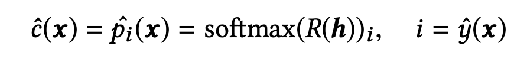

Correct for systematic bias by finding a function to process the logit pre-softmax to match the result to the real proability.

*But it's only systematic bias,* i.e. every input that generates same confidence has the same output probability.

::: notes
Really just a scaling factor, aka every 80% is turned into 60%.

h is the logit, R is the scaling factor, softmax converts it into a probability
:::
---

## This paper's answer: Operational Calibration

It's a given that the system will produce errors, so calibrate the confidence measures to something within reason. But acknowledge that *it isn't systemic*.

Operational Calibration doesn't change the prediction, only the estimation of the likelihood that it is correct. **Why is this important?**

::: notes
Take a set of your "real world" operational data.

It's like fine-tuning, but only for confidence scores.

What if the prediction is wrong?
:::
---

## Brier score

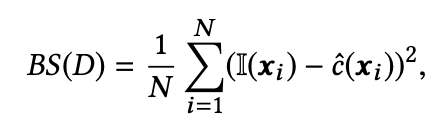

Quantify the accuracy of the confidence with mean-squared error of the estimation.

I(x) is whether it was correctly classified or not.

::: notes
I hate math, but this is just the normal mean-squared error, just about how off the estimates are.
:::
---

## The formal definition

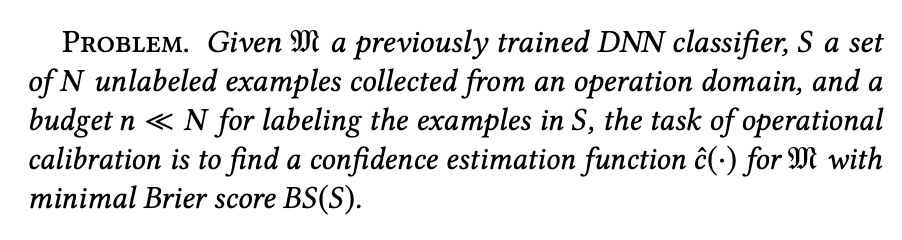

Test as much operational data as you can (the "budget"), and adjust confidence accordingly.

> The challenge here is to strike a balance between the priori that was learned from a huge training dataset but suffering from domain shift, and the evidence that is collected from the operation domain but limited in volume.

---

## How do we do it?

We can't test everything, so we use a Bayesian technique and model the problem as a Gaussian Process. As we get more data about how off the confidence scores are, we adjust.

::: notes
It's a distribution, not just a number
:::
---

## The goal: Gaussian Process *c*

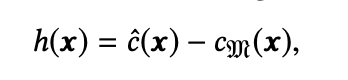

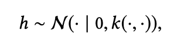

::: notes
TS is just a single scaling function, while this will change based on the input.
:::
---

## The goal: Gaussian Process (cont'd)

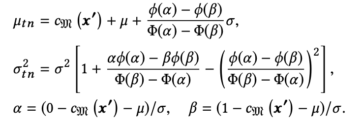

The mode of the distribution is our true/estimated probability score.

::: notes
A point should have a confidence related to the confidences around it.

Similar inputs, similar outputs.

As you get information about some points, it also changes the confidence of the other points. But where is the 'point'?
:::

---

## Step 1: Feature extraction

We treat the last hidden layer as the features of input *x*.

**Assumption:** A prediction by the network is more likely to be correct if it's close to a correct prediction, and incorrect if close to an incorrect prediction. Same with confidences!

**Assumption:** Feature space is lumpy and clusterable.

---

## Step 2: Clustering

Allows different clusters to have different covariance functions

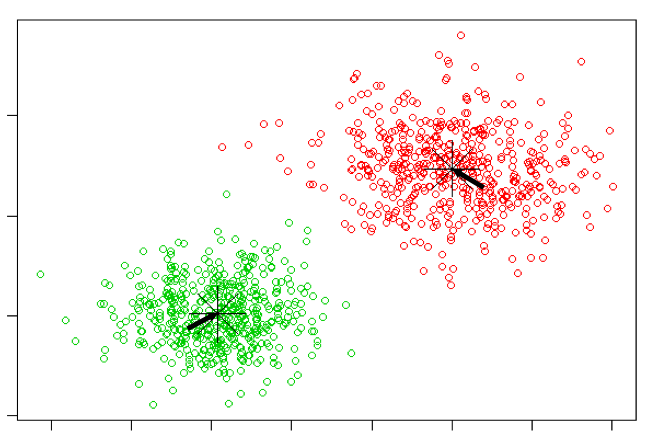

Decreases computational cost of the Gaussian Processes - one for each cluster.

---

## LCE (Loss due to confidence error)

Not all mistakes are created equal. 

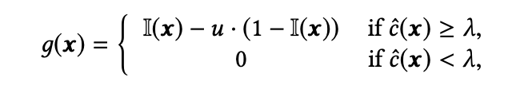

This model assumes no cost or gain if no decision is made, and loss is *u* for a mistake. 

::: notes
x = input

λ = confidence score boundary

I = 1 if correct 0 if incorrect

g(x) = gain

u = loss for mistake
:::

---

## Selecting operational data

The focus of operational calibration is **successful budgeting**. You don't have all the time, money, and labels in the world.

How do you pick the data to improve the scores for?

---

## Selecting data to label

1. Select the operational input at center of each cluster, apply Gaussian Process to compute confidence distribution.
2. Select the most "helpful" to label, update gaussian process.
3. Repeat until budget is used up!

You want to reduce variance as much as possible, and pay attention to those near the break-even threshold to reduce LCE.

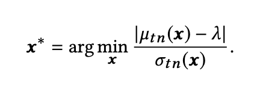

::: notes
delta is the your confidence boundary

sigma is the variance

gamma is the estimated confidence
:::

---

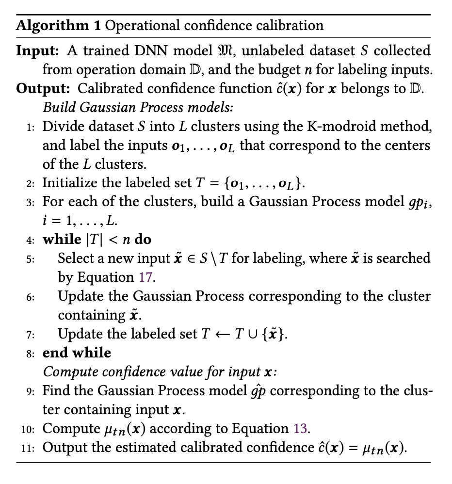

---

## Why is it more effective?

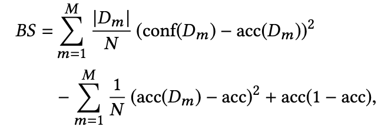

* **Realiability** distance between confidence and true probability
* **Resolution** distinctions of predictive probabilities
* **Uncertainty** accuracy of the model

Systemic error is only *reliability* (e.g. TS). OC also cares about *resolution*.

---

## When is it not more effective?

If the error *is* systemic, then you're doing all of this extra work for nothing. Why put things into groups if each group is the same?

When the cost of a false prediction is low enough, errors don't matter and LCE doesn't have an effect. 

---

## Empirical evaluation

1. Is our approach to operational calibration generally effective in different tasks?
2. How effective it is, compared with alternative approaches?
3. How efficient it is, in the sense of saving labeling efforts?

---

## Six tasks

Varied across domains, operational dataset size, number of classes to classify (classification difficulty), and parameter size (model complexity).

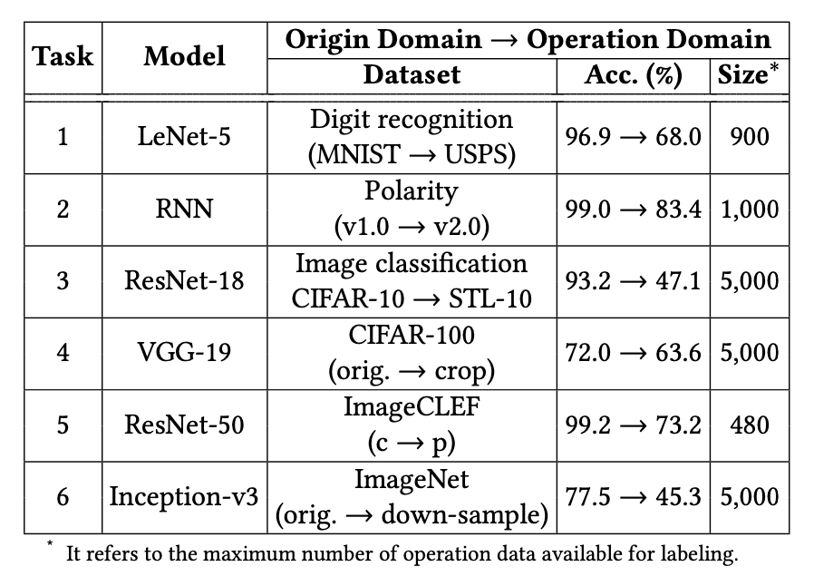

::: notes
1. Images: Applied MNIST-trained model to similar but dirtier USPS data
2. Text: Applied 2002-movie-review model to 2004-movie-review data
3. Images: Applied CIFAR-10-trained model to STL
4. Images: Applied CIFAR-100-trained model to cropped CIFAR-100
5. Images: ImageNet 2012-trained model to Pascal VOC 2012
6. Images: Applied pre-trained ImageNet Inception v3 to downsampled ImageNet

:::
---

Operational calibration worked **wonders** on the Brier score.

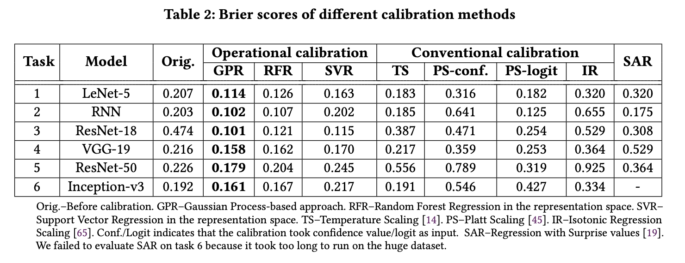

No matter what kind of regression was used, it almost always came out over Temperature Scaling.

---

## Relationship to fine-tuning

Operational Calibration worked both when fine-tuning was effective (simple tasks, e.g. MNIST, binary classification) and when it was ineffective (non-trivial tasks, e.g. ImageNet). **Fine-tuning does not necessarily provide accurate confidence**

> the Brier score would decrease more if we spent rest operation data on calibration than continuing on the fine-tuning

Worthwhile in **all situations** when you want to control the impact of incorrect classifications. 

---

## Compared to other methods

Beat out temperature scaling, Platt scaling, enhanced Platt scaling, and Isotonic Regression.

Also tried two other techniques for regression to see if GPR was the right approach. It was!

---

## Efficiency

While it works for metrics like LCE and Brier outcome, what about high-confidence false predictions? Labeled **10% of operational data.**

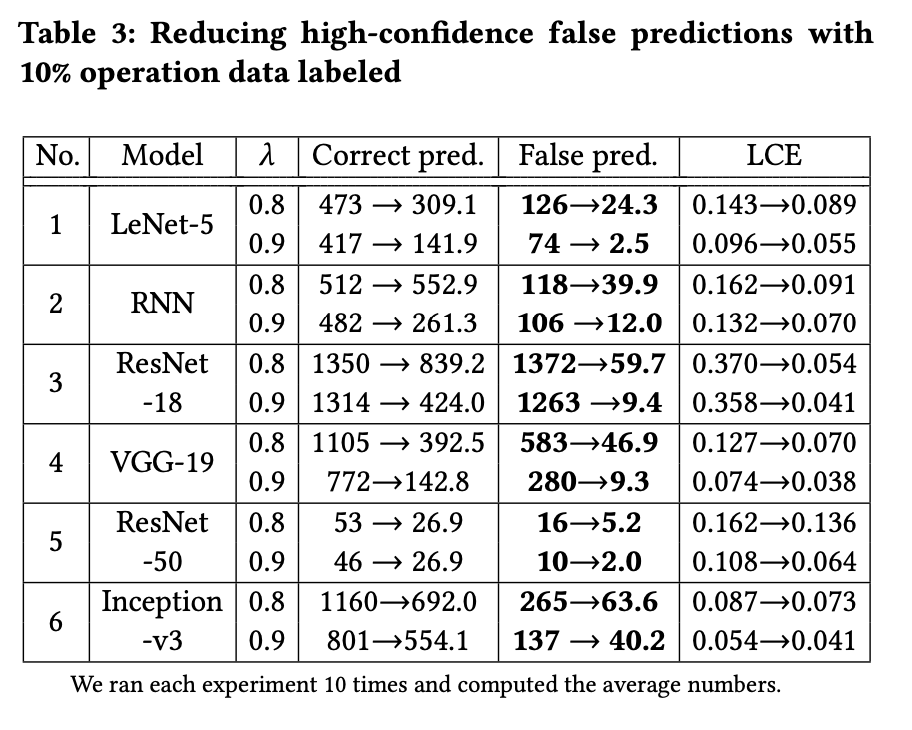

What about accuracy? Is this actually an improvement? **LCE went down**

---

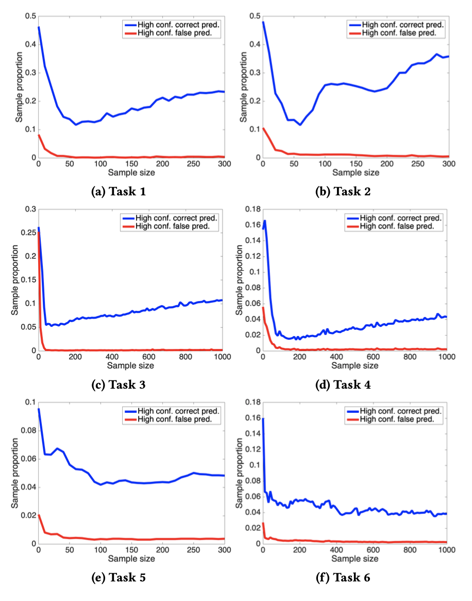

---

## Related work

The differentiating factor is it focuses on **operational data** and is easily useable with **COTS systems**. Is a DNN's output a feature or a bug? Only know when it's in production!

Inspired by transfer learning, but operational calibration has very limited data from the target/operational domain.

Active learning selected targets to label deliberately, like is done in OC with GPR.

---

## Questions?

